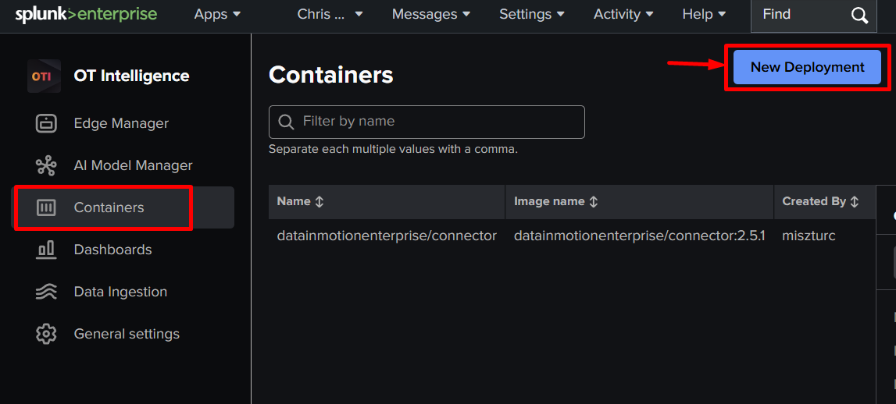
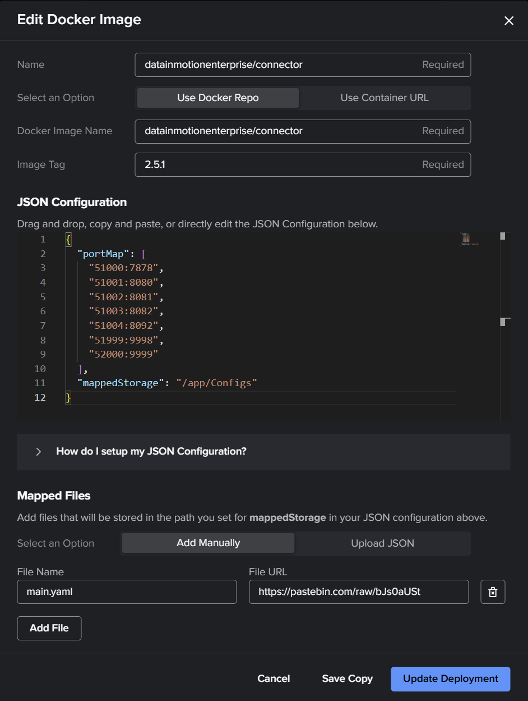
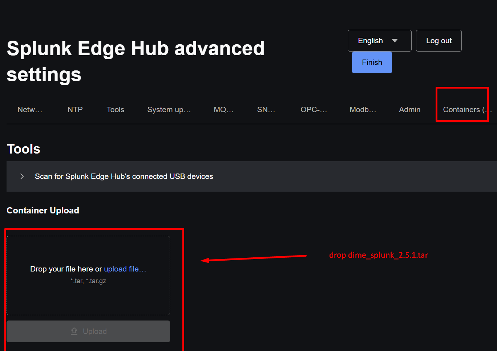
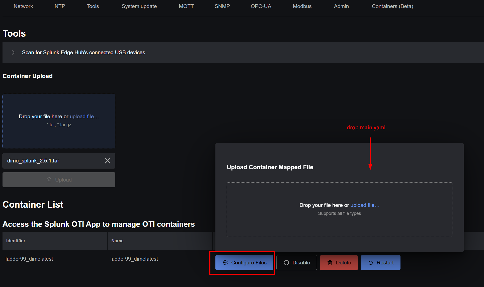
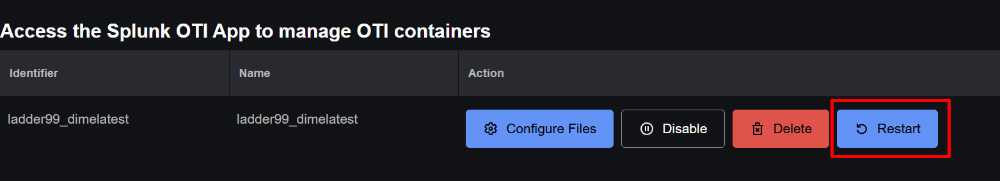

# Splunk and DIME Connector

How to deploy DIME Connector on a Splunk Edge Hub.

## OTI Deployment

**How to deploy DIME Connector to a Splunk Edge Hub.**

1. In the OTI dashboard go to 'Containers' and click 'New Deployment'

    

2. Fill out the fields.  
  a. Name -> `dime_demo01`  
  b. Select an Option -> Use Docker Repo  
  c. Docker Image Name -> `datainmotionenterprise/connector`  
  d. Image Tag -> `3.0.0`  
  e. JSON Configuration

```json
{
  "portMap": [
    "51000:7878",
    "51001:8080",
    "51002:8081",
    "51003:8082",
    "51004:8092",
    "51999:9998",
    "52000:9999"
  ],
  "mappedStorage": "/app/Configs"
}
```

3. Mapped Files:Select an Option -> Add Manually  
    a. Click 'Add File'  
    b. File Name -> `main.yaml`  
    c. File URL -> https://raw.githubusercontent.com/DataInMotionEnterprise/DIME-Connector.Docker/main/Splunk/Configs/SplunkEdgeHubSingleFileV2/main.yaml

    

4. Click 'Create Deployment'.

## Edge Hub Deployment

**How to run DIME Connector directly on the Splunk Edge Hub.**

These instructions require both physical and local network access to the Edge Hub.

1. Download the DIME Connector tarball to your computer.  
    [DIME Connector Splunk tarball version 3.0.0](https://github.com/DataInMotionEnterprise/DIME-Releases/releases/download/connector-3.0.0/dime-connector-splunk-3.0.0.tar)
2. Download the example YAML configuration as `main.yaml`.  
    [Example YAML configuration](https://raw.githubusercontent.com/DataInMotionEnterprise/DIME-Connector.Docker/main/Splunk/Configs/SplunkEdgeHubSingleFileV2/main.yaml)
3. Enable advanced configuration from the Edge Hub device and retrieve the URI and login credentials.
4. Log into the Edge Hub from a browser using the obtained URI and credentials.
5. Navigate to the `Containers` tab.
6. Upload the previously downloaded `dime-connector-splunk-{version}.tar` file.
    
7. Click `Configure Files` and upload the previously downloaded `main.yaml` file.
    
8. Click `Restart` to restart the container.
    
9. After refreshing the web page, you should see that the container is up and running.
    